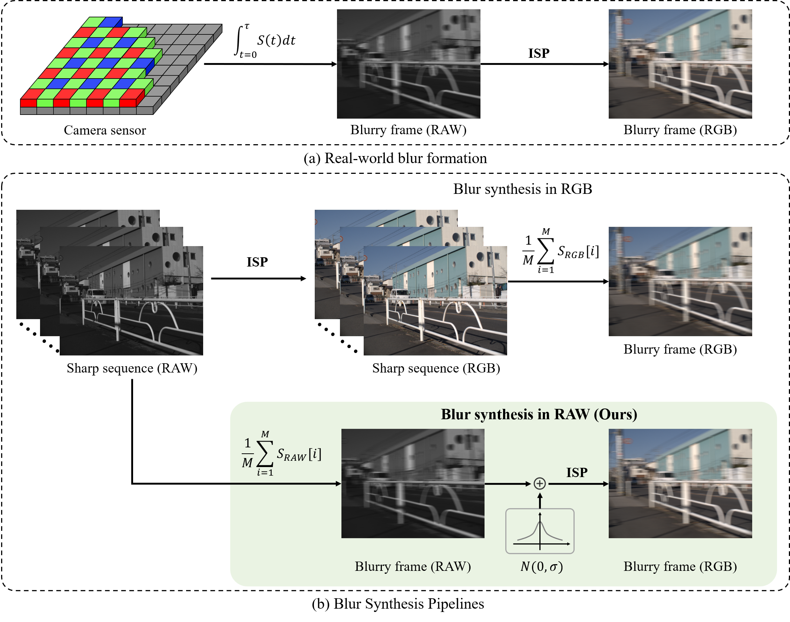

# RAWBlur
Towards Real-World Video Deblurring by Exploring Blur Formation Process

[ArXiv](https://arxiv.org/abs/2208.13184) **|** [UHFRaw Dataset](https://drive.google.com/drive/folders/1hlxTVizoH8-AJGMbS_d-LRRdivSPIvcz?usp=share_link) **|** [Extended Version (coming soon)]()

---

> We explore the blur formation process and propose to synthesize realistic blurs in RAW space rather than RGB space for real-world video deblurring. A novel blur synthesis pipeline RAWBlur and a corresponding UHFRaw (ultra-high-framerate RAW video) dataset are presented. Corresponding experiments and analysis demonstrate the proposed pipeline can help existing video deblurring models generalize well in the real blurry scenarios.

<div aligh="center>

</div>

## RAWBlur Pipeline

<div align=center>

<p>
Real-world and synthetic blur formation processes. Our pipeline directly synthesize the blurs in RAW space and further add the noise to simulate the real blurs.
</p>
</div>

## UHFRaw Dataset

You can download the source ultra high-framerate sharp frames dataset UHFRaw:

[Google Drive](https://drive.google.com/drive/folders/1kTUaUIal2oiCP0dWb-nM9Kf7uGPTc9RZ?usp=share_link)

Baidu Yun (coming soon)

Note that the dataset can be only used for research purpose.

## Training Configs

We use the inplementations of DBN and EDVR in [SimDeblur](https://github.com/ljzycmd/SimDeblur) framework, and train these models with the synthesized blurry video.

## Citation

If RAWBlur piepline and UHFRaw dataset are useful for your research, please consider citing our paper

```bibtex
@article{cao2022towards,
  title={Towards real-world video deblurring by exploring blur formation process},
  author={Cao, Mingdeng and Zhong, Zhihang and Fan, Yanbo and Wang, Jiahao and Zhang, Yong and Wang, Jue and Yang, Yujiu and Zheng, Yinqiang},
  journal={arXiv preprint arXiv:2208.13184},
  year={2022}
}
```

## Contact

If you have any questions about our project, please feel free to contact me at `mingdengcao [AT] gmail.com`.
